# Informe de práctica: Clase practica

Práctica de Diseño de sistemas en Internet, desarrollada el 5 de octubre de 2026. Se integraron las tres guías proporcionadas: creación del ecosistema y persistencia, CRUD de usuarios y autenticación JWT. El resultado es una API local funcional con NestJS 11, Prisma 6.19.3, SQLite y Swagger. Se conservaron capturas auténticas de Visual Studio Code y del navegador, sin la aplicación ChatGPT visible en ellas. Los comandos se ejecutaron mediante herramientas de terminal y sus salidas se conservaron como archivos de texto; las capturas de esos registros dentro del editor no son capturas de una terminal integrada. No se consiguió una imagen conjunta de editor y terminal en cada paso. Las imágenes evidencian estados reales del desarrollo y la validación, no cada pulsación ni una autoría manual del estudiante. Los comandos de generación de archivos se ofrecen como referencia reproducible: el esquema y los módulos se escribieron directamente. La captura de versiones corresponde a una verificación final del entorno.

## Objetivo
Construir y verificar una API de usuarios con persistencia, documentación OpenAPI y autenticación JWT.

## Datos de ejecución
- Node.js: 25.8.1; npm: 11.11.0; Nest CLI utilizado: 11.0.24.
- Prisma y Prisma Client: 6.19.3; base de datos SQLite.
- Servidor: http://127.0.0.1:3001; Swagger: http://127.0.0.1:3001/api.
- Nombre y datos del estudiante: completar antes de entregar.

## Paso 1. Preparar el entorno y abrir el proyecto
Base: Guía 1, páginas 1-3.

Se comprobó Node.js v25.8.1 y npm 11.11.0. Se abrió una ventana de Visual Studio Code para la carpeta clase practica. El nombre solicitado se conservó en la carpeta; package.json utiliza clase-practica, sin espacios.

```text
node --version
npm --version
```

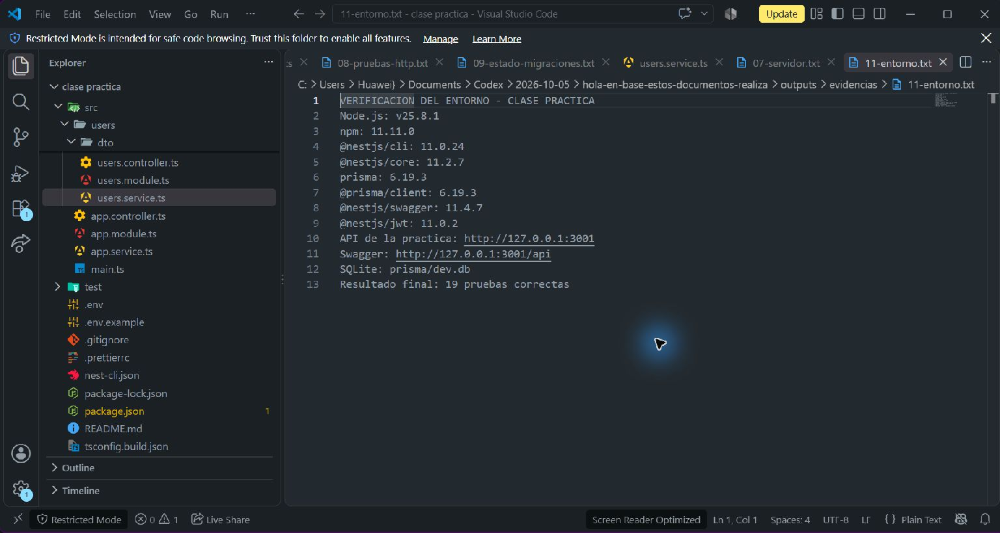

## Paso 2. Crear la plantilla e instalar dependencias
Base: Guía 1, páginas 3-6.

Se generó una plantilla real con Nest CLI 11.0.24. Se utilizó una instalación existente del CLI para evitar una descarga lenta; las dependencias se instalaron con npm y su caché local. No se reutilizó el código de otro proyecto. Se fijó Prisma 6.19.3 para conservar la configuración de las guías.

```text
nest new clase-practica --directory "clase practica" --package-manager npm --skip-install --skip-git --strict
npm install
```

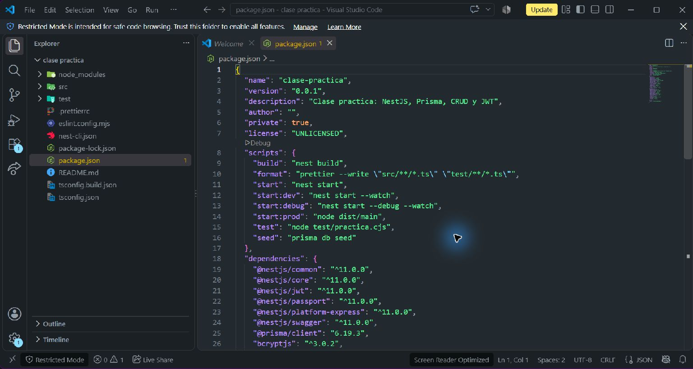

## Paso 3. Configurar Prisma y el modelo User
Base: Guía 1, páginas 9-12.

En prisma/schema.prisma se definieron generator, datasource SQLite y User. El usuario contiene email único, nombre opcional, contraseña, teléfono, fechas y rol USER o ADMIN. La variable DATABASE_URL apunta a file:./dev.db. El secreto JWT se mantiene en .env y no aparece en las capturas.

```text
npm install --save-dev prisma@6.19.3
npm install @prisma/client@6.19.3
npx prisma init --datasource-provider sqlite
```

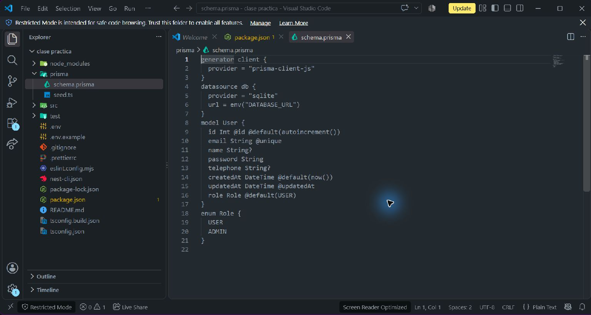

## Paso 4. Aplicar la migración inicial
Base: Guía 1, página 12.

Se ejecutó migrate dev --name init y se creó la migración 20261005185707_init. El primer intento devolvió Schema engine error. La solución fue crear un archivo SQLite vacío y repetir la operación. El registro conservado confirma que la migración se aplicó y se generó Prisma Client.

```text
npx prisma migrate dev --name init
```


## Paso 5. Relacionar User con Tenant
Base: Guía 1, páginas 13-15.

Se agregó Tenant con id, name único y users User[]. User recibe tenantId y la relación mediante fields y references. Un tenant puede tener muchos usuarios; cada usuario pertenece a un tenant. Se aplicó 20261005185725_add_tenant_model.

```text
npx prisma migrate dev --name add_tenant_model
```

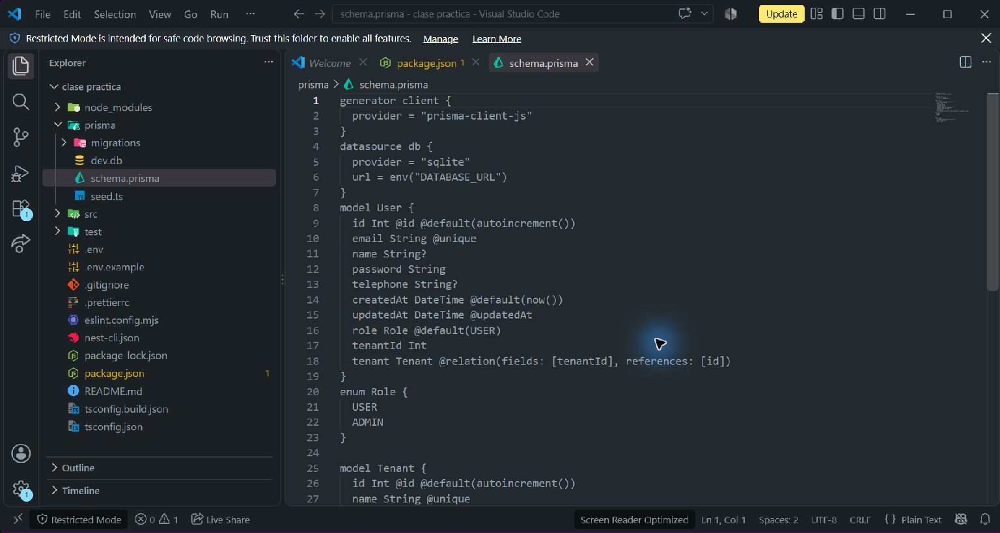

## Paso 6. Insertar datos iniciales con el seeder
Base: Guía 1, páginas 16-17.

prisma/seed.ts utiliza upsert para un tenant y dos usuarios de demostración. bcryptjs genera un hash con costo 10. Los usuarios son admin@clase.local y usuario@clase.local, con contraseña de práctica Practica123!. El registro confirmó: 1 tenant y 2 usuarios.

```text
npm install bcryptjs
npx prisma db seed
```

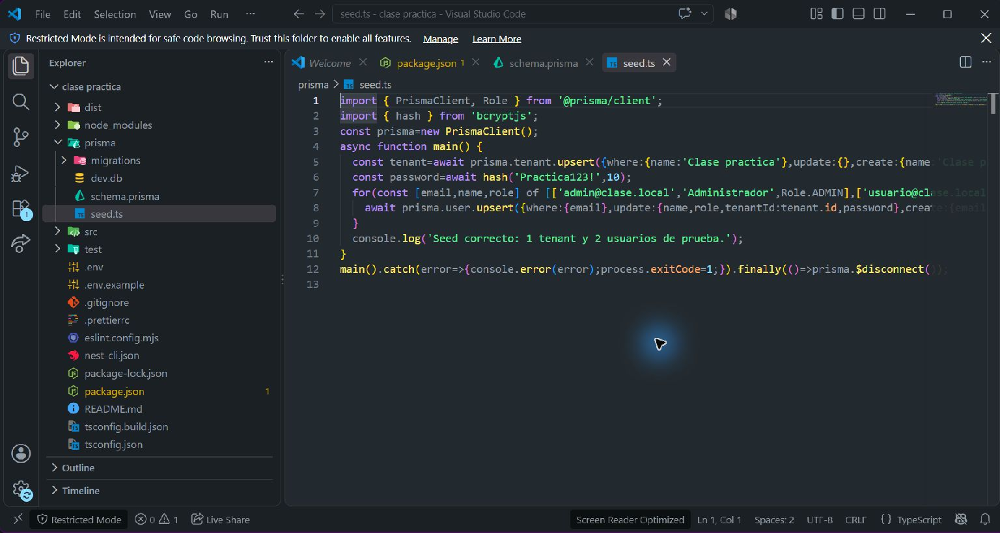

## Paso 7. Crear PrismaModule y PrismaService
Base: Guía 2, página 1.

PrismaService extiende PrismaClient y conecta o desconecta durante el ciclo de vida de Nest. PrismaModule exporta el servicio para compartir la misma instancia por inyección de dependencias. UsersModule y AuthModule importan PrismaModule. Los archivos se implementaron directamente, con la estructura equivalente a los generadores.

```text
nest generate module prisma
nest generate service prisma
```

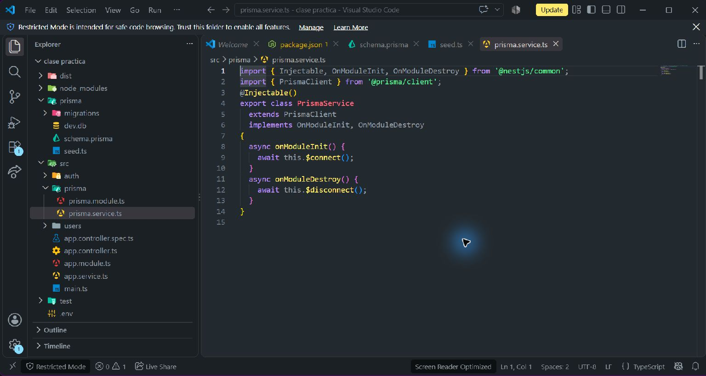

## Paso 8. Configurar Swagger y validación global
Base: Guía 2, página 2; Guía 3, páginas 9-11.

main.ts registra Swagger en /api, define el título Clase practica y configura Bearer JWT. ValidationPipe verifica DTO, elimina la aceptación de propiedades no declaradas y transforma parámetros. La aplicación escucha solo en 127.0.0.1.

```text
npm install @nestjs/swagger swagger-ui-express class-validator class-transformer
http://127.0.0.1:3001/api
```

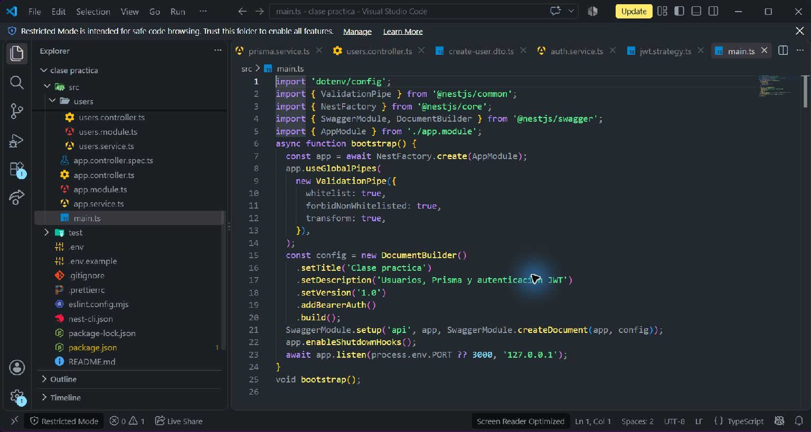

## Paso 9. Definir los DTO de usuarios
Base: Guía 2, páginas 5-6.

CreateUserDto valida email, contraseña de al menos ocho caracteres, tenantId entero positivo y rol. UpdateUserDto hereda el contrato mediante PartialType, haciendo opcionales los campos para PATCH. Swagger documenta sus propiedades y ejemplos.

```text
Crear src/users/dto/create-user.dto.ts
Crear src/users/dto/update-user.dto.ts
```

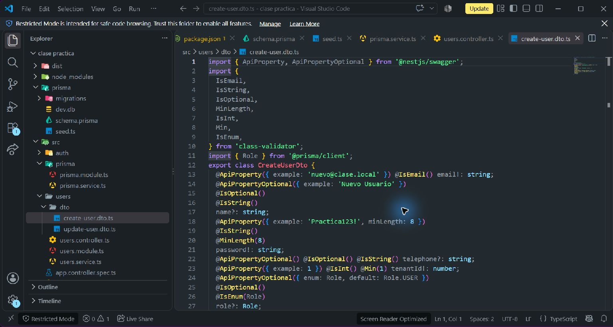

## Paso 10. Implementar las cinco rutas CRUD
Base: Guía 2, páginas 3-6.

UsersController expone POST /users, GET /users, GET /users/:id, PATCH /users/:id y DELETE /users/:id. ParseIntPipe valida el id. El controlador delega al servicio; JwtAuthGuard protege todo el recurso /users en la versión final.

```text
POST /users | GET /users | GET /users/:id
PATCH /users/:id | DELETE /users/:id
```

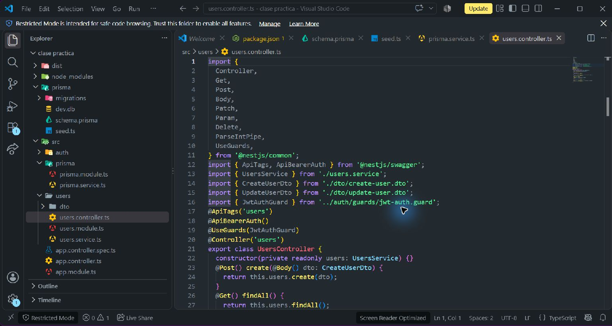

## Paso 11. Persistir las operaciones con Prisma
Base: Guía 2, páginas 4-6.

UsersService utiliza findMany, findUnique, create, update y delete. Las contraseñas nuevas y modificadas se transforman en hashes bcrypt, sin cifrado reversible. Las respuestas seleccionan campos públicos y excluyen password. Correo duplicado devuelve 409, tenant inexistente 400 y usuario ausente 404.

```text
findMany / findUnique / create / update / delete
```

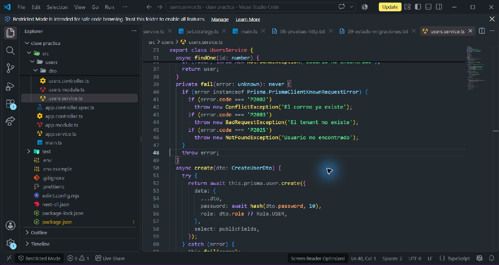

## Paso 12. Crear el login y firmar el JWT
Base: Guía 3, páginas 1-7.

Se agregaron AuthModule, AuthService, AuthController y LoginDto. POST /auth/login recibe email y password. El servicio busca el usuario, compara bcrypt y firma un token con sub, email y role; expira en 3600 segundos. Un error de credenciales devuelve 401.

```text
npm install @nestjs/jwt @nestjs/passport passport passport-jwt
npm install --save-dev @types/passport-jwt
```

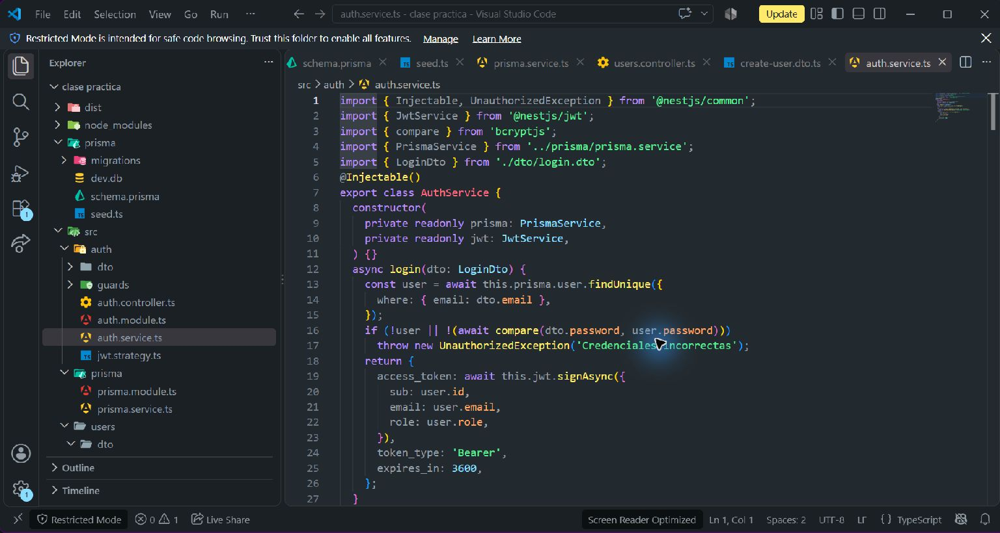

## Paso 13. Verificar JWT y aplicar el guard
Base: Guía 3, páginas 8-9.

JwtStrategy extrae el token del encabezado Authorization: Bearer. Verifica la firma y la expiración; después comprueba que el usuario todavía existe. JwtAuthGuard extiende AuthGuard de Passport. JWT_SECRET se carga desde .env y es obligatorio.

```text
Authorization: Bearer <access_token>
@UseGuards(JwtAuthGuard)
```

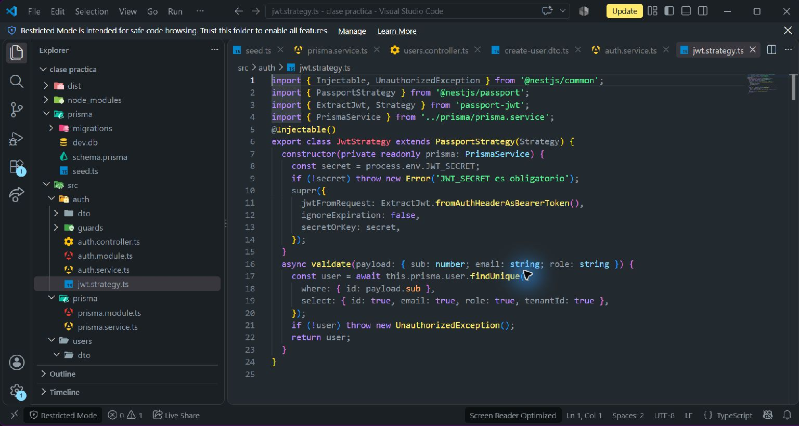

## Paso 14. Compilar y levantar la aplicación
Base: Guía 1, página 4; integración de las tres guías.

La compilación terminó correctamente. Se excluyó prisma/ del tsconfig de compilación para generar dist/main.js. El puerto 3000 estaba ocupado por una aplicación ajena: se configuró PORT=3001 y se verificó la práctica de forma independiente. El registro muestra las rutas y Nest application successfully started.

```text
npm run build
npm run start:prod
Alternativa de desarrollo: npm run start:dev
```

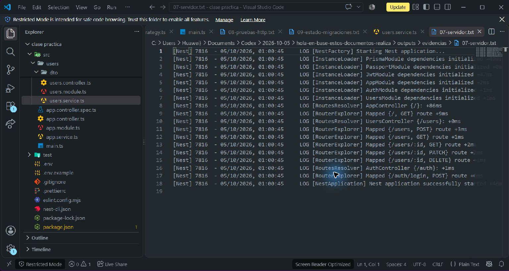

## Paso 15. Explorar la documentación en Swagger
Base: Guía 2, página 2.

Se abrió Swagger en el navegador Edge. Aparecen el endpoint raíz, las cinco rutas de usuarios, el login y los esquemas CreateUserDto, UpdateUserDto y LoginDto. Las pruebas automáticas también confirmaron el documento OpenAPI /api-json.

```text
Abrir http://127.0.0.1:3001/api
```

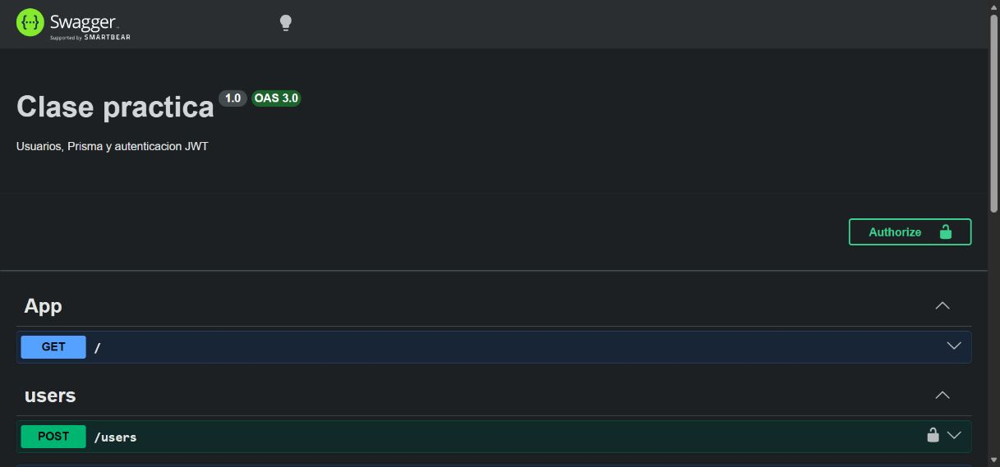

## Paso 16. Probar el login en Swagger
Base: Guía 3, páginas 7 y 10.

En POST /auth/login se pulsó Try it out y Execute con las credenciales locales. La API devolvió HTTP 200 y access_token, token_type Bearer y expires_in 3600. El token de la captura es temporal y corresponde únicamente a la práctica local.

```text
POST /auth/login
{"email":"admin@clase.local","password":"Practica123!"}
```

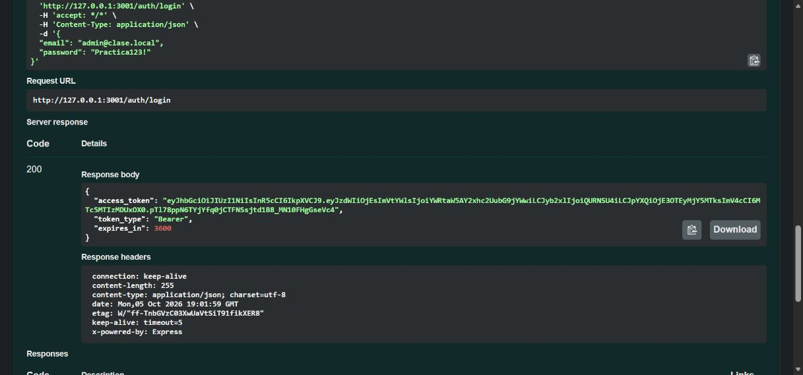

## Paso 17. Consultar usuarios con autorización
Base: Guía 3, páginas 10-11.

Se copió el JWT de la respuesta visible, se abrió Authorize y se aplicó el token sin escribir el prefijo Bearer. GET /users devolvió HTTP 200 y los usuarios iniciales. La respuesta muestra el tenantId y no contiene contraseñas ni hashes.

```text
Authorize > pegar access_token > Apply credentials
GET /users
```

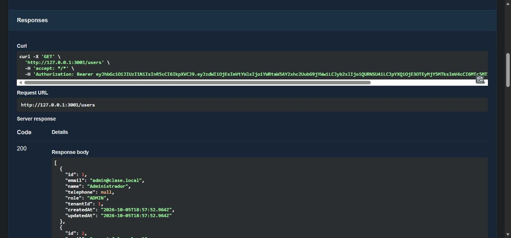

## Paso 18. Comprobar el rechazo sin token
Base: Guía 3, página 11.

Se retiró la autorización y se volvió a ejecutar GET /users. Swagger mostró HTTP 401 con message Unauthorized y statusCode 401, comprobando la protección real de la ruta.

```text
Remove authorization
GET /users
```

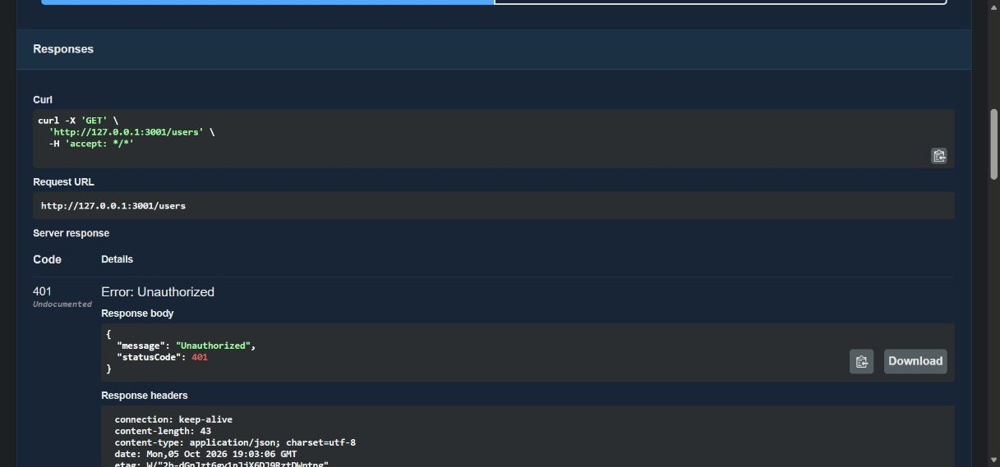

## Paso 19. Ejecutar pruebas completas de la práctica
Base: Verificación adicional del desarrollo.

npm test ejecutó 19 comprobaciones HTTP y de persistencia contra el puerto 3001. Se creó, consultó, modificó y eliminó un usuario temporal. Se comprobó el hash en SQLite y se validaron tokens inválidos y vencidos. Los dos usuarios iniciales permanecen en la base de datos.

```text
Con el servidor encendido, en otra terminal:
npm test
```

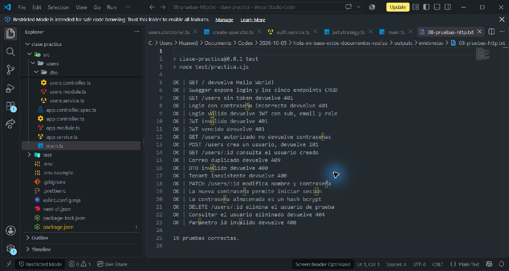

## Paso 20. Verificar migraciones y conservar commits
Base: Guía 1, páginas 15 y 17.

prisma migrate status confirmó dos migraciones y esquema actualizado. Se crearon tres commits locales: modelo y migraciones, seeder y aplicación con CRUD/JWT/pruebas. No se configuró un remoto ni se envió un enlace a Teams: esos pasos requieren el destino y la cuenta del estudiante.

```text
npx prisma migrate status
git log --oneline
```

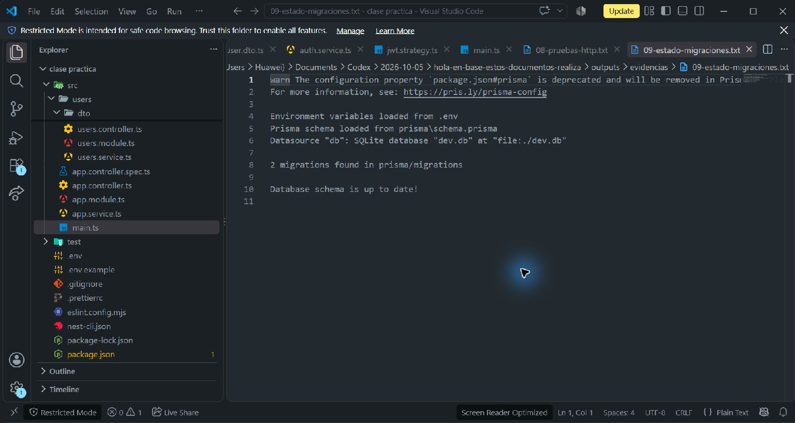

## Resultados de las pruebas

- OK: GET / devuelve Hello World!
- OK: Swagger expone login y los cinco endpoints CRUD
- OK: GET /users sin token devuelve 401
- OK: Login con contraseña incorrecta devuelve 401
- OK: Login válido devuelve JWT con sub, email y role
- OK: JWT inválido devuelve 401
- OK: JWT vencido devuelve 401
- OK: GET /users autorizado no devuelve contraseñas
- OK: POST /users crea un usuario, devuelve 201
- OK: GET /users/:id consulta el usuario creado
- OK: Correo duplicado devuelve 409
- OK: DTO inválido devuelve 400
- OK: Tenant inexistente devuelve 400
- OK: PATCH /users/:id modifica nombre y contraseña
- OK: La nueva contraseña permite iniciar sesión
- OK: La contraseña almacenada es un hash bcrypt
- OK: DELETE /users/:id elimina el usuario de prueba
- OK: Consultar el usuario eliminado devuelve 404
- OK: Parámetro id inválido devuelve 400

## Incidencias y decisiones

La descarga inicial del CLI fue lenta; se utilizó un Nest CLI ya instalado y npm instaló las dependencias desde su caché. npm ci detectó un lockfile incompatible durante la preparación; npm install resolvió el árbol y actualizó package-lock.json. SQLite necesitó un archivo vacío antes de la primera migración. Se corrigió la ubicación de dist/main.js mediante tsconfig.build.json. Se cambió de 3000 a 3001 por un puerto ocupado. Una primera comprobación apuntó a la aplicación del puerto 3000 y se descartó; las 19 pruebas finales y las capturas de Swagger corresponden al proyecto del puerto 3001.

## Conclusiones y alcance

Se completó el proyecto funcional de las tres guías: esquema relacional, migraciones, datos iniciales, servicio Prisma compartido, CRUD con validación, Swagger y JWT. Las 19 verificaciones finales fueron correctas. La práctica comprueba autenticación; el rol del JWT no impone permisos por rol y la relación tenant no implementa aislamiento de datos. Las credenciales son de demostración local. Los commits son locales; la entrega a Teams queda a cargo del estudiante con su cuenta y el destino correspondiente.

## Repetir la práctica

El ZIP incluye el código, los commits y las evidencias; excluye node_modules, dist, la base de datos y .env. Extraer, abrir clase practica y seguir README.md: npm ci; copiar .env.example a .env; generar un JWT_SECRET; prisma migrate deploy; prisma generate; prisma db seed; npm run build; npm run start:prod. En otra terminal, npm test. Para modificar el esquema se utiliza migrate dev; para aplicar las migraciones existentes en una copia nueva se utiliza migrate deploy.

## Fuentes

GD_S7_S1.pdf: guía 1, 17 páginas. GD_S7_S2.pdf: guía 2, 6 páginas. GD_S8_S1_FinalNode.pdf: guía 3, 11 páginas. Consulta técnica: https://docs.nestjs.com/recipes/prisma y https://docs.nestjs.com/security/authentication. Se conservó Prisma 6 para mantener el estilo de configuración de las guías; la receta oficial consultada actualmente explica Prisma 7. Los comandos propuestos por las guías se corrigieron cuando requerían sintaxis válida, por ejemplo npx prisma migrate dev --name init. Las instrucciones de publicar y enviar a Teams contenidas en los PDF no se trataron como una autorización para comunicar datos a terceros.

## Commits locales
```text
86f9b41 Guias 2 y 3: CRUD, Swagger, JWT y pruebas HTTP
cbd5705 Guia 1: datos iniciales con bcrypt
5587d95 Guia 1: modelo User y Tenant con migraciones

```